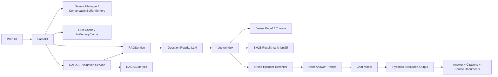

# LangChain Business RAG QA System

[中文说明 / Chinese README](./README.zh-CN.md)  
[中文技术博客 / Chinese Technical Blog](./docs/blog_zh.md)  
[Architecture Diagram](./docs/business_rag_architecture.mmd)

This repository contains a production-style RAG QA system built with LangChain for Chinese business knowledge bases. It supports document ingestion, multi-turn conversation, question rewriting, hybrid retrieval, reranking, structured answers, source tracing, RAGAS evaluation, and a lightweight web UI.

The project defaults to DeepSeek, while remaining compatible with OpenAI-style `base_url + api_key + model` endpoints.

## Highlights

- Multi-turn chat with `ConversationBufferMemory`
- Strict grounded answering with "I don't know" fallback
- `ChatPromptTemplate.from_messages` for rewrite and answer prompts
- Pydantic structured output for `answer`, `grounded`, `citations`, and `source_documents`
- Hybrid retrieval with Chroma dense recall and `rank_bm25`
- Cross-Encoder reranking with `sentence-transformers`
- LangChain `InMemoryCache` for repeated LLM calls
- Built-in RAGAS benchmark for regression evaluation
- FastAPI web app for upload, path ingestion, chat, health, cache stats, and evaluation

## Architecture



## Project Structure

```text
langchain-business-rag/
├── app/
│   ├── cache.py
│   ├── config.py
│   ├── document_loader.py
│   ├── embeddings.py
│   ├── evaluation.py
│   ├── knowledge_base.py
│   ├── models.py
│   ├── prompts.py
│   ├── rag_chain.py
│   ├── reranker.py
│   ├── server.py
│   ├── session_manager.py
│   ├── splitter.py
│   └── vector_store.py
├── data/
│   ├── sample_docs/
│   └── uploads/
├── docs/
│   ├── blog_zh.md
│   └── business_rag_architecture.mmd
├── static/
├── templates/
├── main.py
└── requirements.txt
```

## Tech Stack

- `FastAPI` for JSON APIs and the demo web UI
- `LangChain` for prompts, memory, chat models, and cache orchestration
- `ChromaDB` for dense vector storage
- `rank_bm25` for keyword recall
- `sentence-transformers` for embeddings and Cross-Encoder reranking
- `LangChain InMemoryCache` for exact-match LLM caching
- `RAGAS 0.1.21` for evaluation on Python 3.8

## Getting Started

### 1. Install dependencies

```bash
cd /Users/wilson.zhang/Desktop/agent_engineering_lessons/langchain-business-rag
python3 -m pip install -r requirements.txt
```

### 2. Configure environment variables

Recommended DeepSeek setup:

```bash
export DEEPSEEK_API_KEY="your DeepSeek API key"
export DEEPSEEK_BASE_URL="https://api.deepseek.com"
export DEEPSEEK_MODEL="deepseek-chat"
```

Optional retrieval, reranking, and cache settings:

```bash
export RAG_TOP_K="4"
export RAG_CHUNK_SIZE="320"
export RAG_CHUNK_OVERLAP="60"
export RAG_CANDIDATE_TOP_K="12"
export ENABLE_RERANKING="true"
export RERANKER_MODEL_NAME="BAAI/bge-reranker-base"
export RERANK_BATCH_SIZE="16"
export ENABLE_LLM_CACHE="true"
```

OpenAI-style configuration is also supported:

```bash
export OPENAI_API_KEY="your API key"
export OPENAI_BASE_URL="your compatible endpoint"
export OPENAI_MODEL="gpt-4o-mini"
```

Optional provider override:

```bash
export LLM_PROVIDER="deepseek"
```

Notes:

- The default chat model is `deepseek-chat`.
- `deepseek-reasoner` is not recommended here because the project depends on structured output behavior.
- `ENABLE_LLM_CACHE=true` enables LangChain `InMemoryCache`.
- `InMemoryCache` is an exact-match in-memory LLM cache, not an embedding-based semantic cache.
- The reranker model may need a one-time download on first use.

### 3. Start the server

```bash
cd /Users/wilson.zhang/Desktop/agent_engineering_lessons/langchain-business-rag
python3 main.py
```

Open:

```text
http://127.0.0.1:8000
```

### 4. Suggested demo flow

1. Click "Load sample knowledge base"
2. Ask "What should happen when a refund amount is higher than 200 RMB?"
3. Follow up with "Then who needs to confirm it?"
4. Run the built-in benchmark from the web page

## API Overview

- `POST /api/session`
- `GET /api/sessions/{session_id}/documents`
- `POST /api/documents/sample`
- `POST /api/documents/path`
- `POST /api/documents/upload`
- `POST /api/chat`
- `POST /api/evaluate`
- `POST /api/cache/reset`
- `POST /api/session/reset`
- `GET /api/health`

## Key Implementation Notes

### Rewrite before retrieval

The system rewrites follow-up questions into standalone search queries before retrieval, so pronouns and omitted context do not hurt recall quality.

### Hybrid retrieval plus reranking

The retrieval stack combines:

1. Dense recall in Chroma
2. BM25 keyword recall
3. Cross-Encoder reranking

This is especially useful for threshold-based policies, product names, rule identifiers, and short business queries.

### LLM cache

[`app/cache.py`](./app/cache.py) wraps LangChain `InMemoryCache` and exposes basic observability:

- `hits`
- `misses`
- `writes`
- `entries`

This is useful for repeated prompting and benchmark regression runs.

### RAGAS benchmark

[`app/evaluation.py`](./app/evaluation.py) includes a built-in benchmark over the sample business documents and computes:

- `faithfulness`
- `answer_relevancy`
- `context_recall`
- `context_precision`
- `answer_correctness`

The benchmark uses isolated temporary memory so evaluation does not pollute the active chat session.

## Supported File Types

- `.txt`
- `.md`
- `.pdf`
- `.docx`

## FAQ

### Why mention "semantic cache" while using `InMemoryCache`?

Strictly speaking, LangChain `InMemoryCache` is not a semantic cache. It is an exact-match LLM cache. This repository keeps the implementation accurate and explicitly documents that distinction.

### Why pin `ragas` to `0.1.21`?

This project currently runs on Python 3.8. Newer `ragas` releases use newer Python syntax, so `0.1.21` is the stable compatible choice here.

### Where is the Chinese documentation?

Use [README.zh-CN.md](./README.zh-CN.md) for the full Chinese project guide, and [docs/blog_zh.md](./docs/blog_zh.md) for the Chinese technical article draft.
