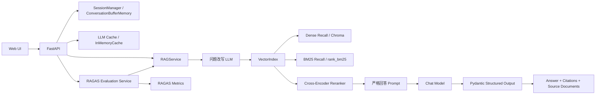

# LangChain Business RAG QA System

[English README](./README.md)

这是一个放在 `langchain-business-rag` 目录下的完整业务型 RAG 问答系统，面向中文知识库场景设计，支持文档导入、多轮对话、代词指代理解、混合召回、Cross-Encoder reranking、结构化输出、引用溯源、RAGAS 评估和 Web 交互。

项目默认推荐使用 DeepSeek API，同时兼容 OpenAI 风格接口。

## 项目亮点

- 多轮问答：使用 `ConversationBufferMemory` 保存历史，追问里的“它”“这个规则”等代词会先做问题改写再检索。
- 严格回答：Prompt 要求模型只能基于上下文回答，不知道就直接回答“我不知道”。
- 结构化输出：使用 Pydantic 约束 `answer`、`grounded`、`citations`、`source_documents`。
- 混合召回：向量检索 + `rank_bm25` 关键词检索融合。
- 精排优化：使用 `sentence-transformers` 的 Cross-Encoder 做 reranking。
- 缓存优化：接入 LangChain `InMemoryCache`，重复 Prompt 可以直接命中缓存。
- 质量评估：集成 RAGAS Benchmark，支持一键跑忠实度、答案相关性、上下文召回、上下文精度、答案正确性。
- Web 界面：支持上传文档、按路径导入、样例知识库、聊天、查看引用、查看缓存和评估结果。

## 系统架构



## 目录结构

```text
langchain-business-rag/
├── app/
│   ├── cache.py
│   ├── config.py
│   ├── document_loader.py
│   ├── embeddings.py
│   ├── evaluation.py
│   ├── knowledge_base.py
│   ├── models.py
│   ├── prompts.py
│   ├── rag_chain.py
│   ├── reranker.py
│   ├── server.py
│   ├── session_manager.py
│   ├── splitter.py
│   └── vector_store.py
├── data/
│   ├── sample_docs/
│   └── uploads/
├── docs/
│   ├── blog_zh.md
│   └── business_rag_architecture.mmd
├── static/
├── templates/
├── main.py
└── requirements.txt
```

## 技术选型

- `FastAPI`
  提供 JSON API 和轻量 Web 页面，便于快速演示和继续扩展。
- `LangChain`
  用来组织 Prompt、Memory、Chat Model、Cache 等核心组件。
- `ChatPromptTemplate.from_messages`
  定义问题改写 Prompt 和严格基于上下文回答的 Prompt。
- `ConversationBufferMemory`
  管理多轮历史，让追问能先补全再检索。
- `ChromaDB`
  持久化向量索引，做 Dense Retrieval。
- `rank_bm25`
  增强关键词、专有名词、短 Query 的召回能力。
- `sentence-transformers`
  同时用于本地向量化和 Cross-Encoder reranking。
- `LangChain InMemoryCache`
  缓存完全相同的 LLM 请求，减少重复改写和重复回答的耗时。
- `RAGAS 0.1.21`
  用于评估 RAG 质量。当前项目运行在 Python 3.8，因此锁定到兼容版本。

## 运行方式

### 1. 安装依赖

```bash
cd /Users/wilson.zhang/Desktop/agent_engineering_lessons/langchain-business-rag
python3 -m pip install -r requirements.txt
```

### 2. 配置环境变量

推荐直接使用 DeepSeek：

```bash
export DEEPSEEK_API_KEY="你的 DeepSeek API Key"
export DEEPSEEK_BASE_URL="https://api.deepseek.com"
export DEEPSEEK_MODEL="deepseek-chat"
```

检索、缓存和 reranking 相关可选项：

```bash
export RAG_TOP_K="4"
export RAG_CHUNK_SIZE="320"
export RAG_CHUNK_OVERLAP="60"
export RAG_CANDIDATE_TOP_K="12"
export ENABLE_RERANKING="true"
export RERANKER_MODEL_NAME="BAAI/bge-reranker-base"
export RERANK_BATCH_SIZE="16"
export ENABLE_LLM_CACHE="true"
```

如果你已经在使用 OpenAI 风格环境变量，也兼容：

```bash
export OPENAI_API_KEY="你的 API Key"
export OPENAI_BASE_URL="你的兼容接口地址"
export OPENAI_MODEL="gpt-4o-mini"
```

可选地显式指定提供方：

```bash
export LLM_PROVIDER="deepseek"
```

说明：

- 默认聊天模型是 `deepseek-chat`
- `deepseek-reasoner` 当前不建议直接替换，因为项目依赖结构化输出
- `ENABLE_LLM_CACHE=true` 时会启用 LangChain `InMemoryCache`
- `InMemoryCache` 是内存级精确命中缓存，不是 embedding-based 的语义相似缓存
- 首次启用 Cross-Encoder reranking 时，模型可能需要联网下载

### 3. 启动服务

```bash
cd /Users/wilson.zhang/Desktop/agent_engineering_lessons/langchain-business-rag
python3 main.py
```

浏览器打开：

```text
http://127.0.0.1:8000
```

### 4. 推荐体验路径

1. 点击“加载内置样例知识库”
2. 提问“退款金额高于 200 元怎么办？”
3. 再追问“那它需要谁二次确认？”
4. 点击“运行评估”查看 RAGAS Benchmark

你会看到：

- 页面直接展示当前模型、Embedding、reranking 和缓存状态
- 聊天回答附带引用来源和 `source_documents`
- 缓存会记录 hits / misses / entries
- RAGAS 会输出 5 个业务问题的分项指标和总览指标

## API 说明

- `POST /api/session`
  创建会话。
- `GET /api/sessions/{session_id}/documents`
  查看当前会话已导入的文档。
- `POST /api/documents/sample`
  导入内置业务样例知识库。
- `POST /api/documents/path`
  通过文件路径导入文档。
- `POST /api/documents/upload`
  通过 Web 上传文档。
- `POST /api/chat`
  发起问答，返回结构化答案和 `source_documents`。
- `POST /api/evaluate`
  运行内置 RAGAS Benchmark。
- `POST /api/cache/reset`
  清空 LangChain `InMemoryCache`。
- `POST /api/session/reset`
  清空会话历史，或连同知识库一起重置。
- `GET /api/health`
  查看模型、Embedding、Cache、Reranker 状态。

## 关键实现

### 1. 问题改写 + 严格回答

[`app/rag_chain.py`](./app/rag_chain.py) 中的核心流程是：

1. 读取 `chat_history`
2. 调用问题改写 Prompt，把追问变成独立问题
3. 走混合召回和 reranking
4. 把命中的片段格式化成带 `source_id` 的上下文
5. 调用严格回答 Prompt，输出 Pydantic 结构化结果

### 2. 混合召回 + 重排

[`app/vector_store.py`](./app/vector_store.py) 中做了三段检索：

1. Chroma Dense Recall
2. `rank_bm25` Keyword Recall
3. Cross-Encoder reranking

这让系统既能处理中文语义近似，又能兼顾规则号、关键词和金额阈值这类精确信息。

### 3. LLM Cache

[`app/cache.py`](./app/cache.py) 使用 LangChain `InMemoryCache` 做全局缓存，并额外记录了：

- `hits`
- `misses`
- `writes`
- `entries`

这对重复提问、重复跑 Benchmark 很有帮助。

### 4. RAGAS Benchmark

[`app/evaluation.py`](./app/evaluation.py) 内置了 5 个业务问题，跑以下指标：

- `faithfulness`
- `answer_relevancy`
- `context_recall`
- `context_precision`
- `answer_correctness`

注意：

- 当前 Benchmark 只适配内置样例知识库
- 评估时使用隔离的临时 memory，不会污染当前聊天历史
- 项目当前是 Python 3.8，因此 `ragas` 锁到了 `0.1.21`

## 已支持的文档类型

- `.txt`
- `.md`
- `.pdf`
- `.docx`

## 常见问题

### 1. 为什么页面上叫 Semantic Cache，但代码里是 `InMemoryCache`？

按严格定义，LangChain `InMemoryCache` 不是 embedding-based 的 semantic cache，它是“完全相同 Prompt 命中”的 LLM Cache。这个项目按需求接入了它，并在页面和文档里明确标注了这一点，避免误解。

### 2. 为什么 `ragas` 没有直接用最新版？

当前本地环境是 Python 3.8，而较新的 `ragas` 版本已经开始使用 3.9+ 语法。为了让项目能在现有环境里稳定运行，这里锁定为 `ragas==0.1.21`。

### 3. 为什么 RAGAS Benchmark 只支持样例知识库？

因为评估需要参考答案。当前项目内置了一套与样例知识库对应的业务问题和标准答案，适合做回归测试。如果后续你想评估自定义知识库，需要补一份自己的 benchmark dataset。

## 技术博客

已在 [`docs/blog_zh.md`](./docs/blog_zh.md) 准备了一篇可以直接发到掘金或知乎的中文技术博客，包含：

- 架构图
- 关键代码
- 遇到的问题
- 解决方案

单独的 Mermaid 架构图也放在 [`docs/business_rag_architecture.mmd`](./docs/business_rag_architecture.mmd)。
